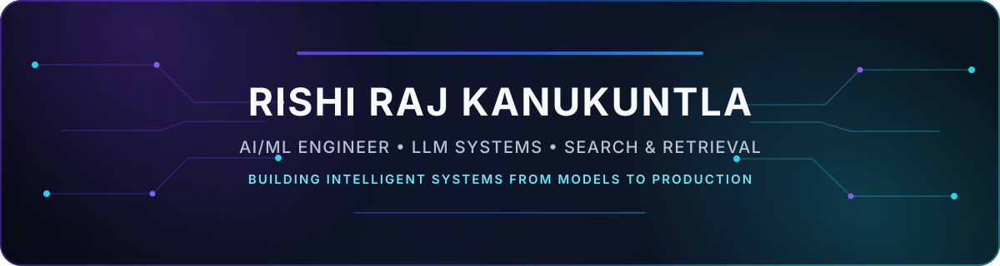
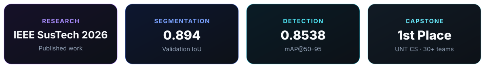

  

 

## About

Computer Science graduate from the **University of North Texas** focused on building AI/ML systems that move from research ideas into usable software. My work spans **LLM applications, retrieval and ranking, recommendation systems, computer vision, backend APIs, and evaluation infrastructure**.

  

## Featured Work

### XpressWeed — Few-Shot Semantic Segmentation
Research on adapting from synthetic leaf imagery to previously unseen real weed classes using texture-prior pretraining and Model-Agnostic Meta-Learning.

`TensorFlow` `Keras` `MAML` `Few-Shot Learning` `Computer Vision`

**0.894 validation IoU** · **0.8538 mAP@50–95** · **IEEE SusTech 2026**  
[View publication →](https://ieeexplore.ieee.org/abstract/document/11536213)

---

### AI Immigration Information Assistant
Python/FastAPI retrieval system designed to answer immigration-information questions from official sources with citation-grounded generation.

`Python` `FastAPI` `PostgreSQL` `Vector Search` `RRF` `Reranking`

Hybrid dense + keyword retrieval · topic-aware query handling · retrieval and generation evaluation  
[View repository →](https://github.com/Rk6113/immigration_law_app)

---

### MYRA — AI Personalization Assistant
AI-powered wardrobe and outfit recommendation system combining a React Native mobile client, backend services, recommendation logic, and 3D visualization.

`React Native` `Node.js` `FastAPI` `MongoDB` `OpenAI` `Recommendation Systems`

**1st Place — UNT CS Capstone 2026 among 30+ teams**  
[View repository →](https://github.com/cherry0722/MYRA)

---

### Agentic Personal AI Assistant
Privacy-focused assistant architecture for schedule context, weather-aware recommendations, memory, and automated morning briefs.

`Rust` `Python` `FastAPI` `PostgreSQL` `Agentic Workflows`

Policy/tooling core · Python AI orchestration · tool registry · progressive automation  
[View repository →](https://github.com/Rk6113/agentic-personal-ai-assistant)

## Tech Stack

### Focus Areas

`LLMs` · `RAG` · `Information Retrieval` · `Vector Search` · `Ranking & Reranking` · `Agentic Workflows` · `Model Evaluation` · `Recommendation Systems` · `Computer Vision` · `Few-Shot Learning`

## Research

**XpressWeed: Texture-Prior Driven Few-Shot Semantic Segmentation with Model-Agnostic Meta-Learning**  
IEEE SusTech 2026  
[Read on IEEE Xplore →](https://ieeexplore.ieee.org/abstract/document/11536213)

---

  AI/ML systems · retrieval · recommendation · computer vision · production engineering

